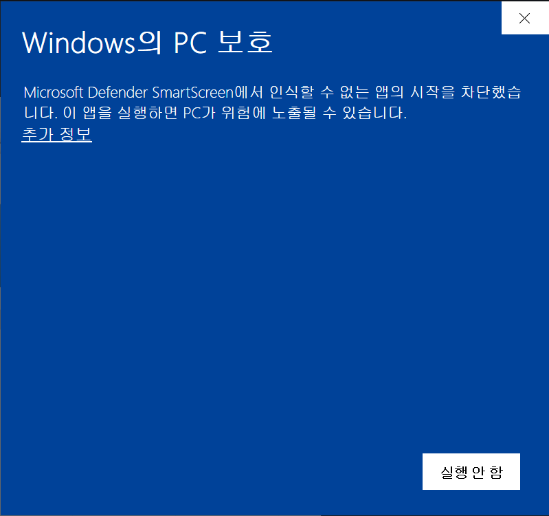
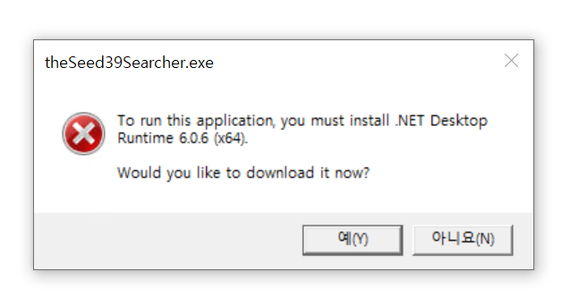

# theSeed39FloorHelper

설명서  
- [정답 검색기](./theSeed39Searcher/readme.md)
- [시뮬레이터](./theSeed39Simulator/readme.md)

## 안내

### Q. 아래처럼 PC 보호라면서 실행이 안돼요.
  

> A. 프로그램 서명을 받지 않아서 Windows Defender에 의해 차단된 경우입니다. 화면의 `추가 정보`를 클릭한 후 실행 버튼을 확인할 수 있습니다.

### Q. 아래 이미지처럼 경고 문구가 뜨고 아니오를 누르면 실행이 안되고, 예를 누르면 이상한 홈페이지로 이동해요. 

> A. 본 프로그램은 .NET 6 기반으로 개발된 C# 프로그램입니다. 따라서 이와같이 나온 경우 사용자분의 `PC에 .NET 6가 설치되지 않았음`을 의미합니다.  
> 1. 예를 눌러 이동할 수 있는 홈페이지에서 .NET 6를 찾아 설치하거나,
> 2. 압축파일 중 `DirectExecute`라는 문구가 붙은 압축파일을 다운로드받아
>
> 실행할 수 있습니다.