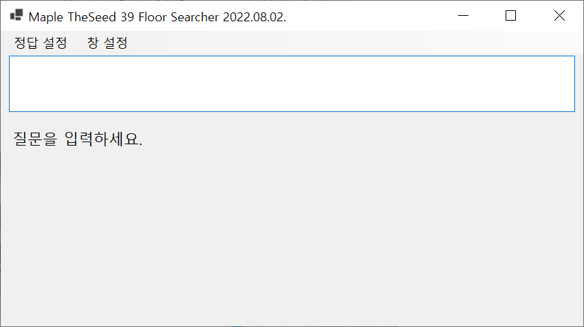

# theSeed39Searcher
메이플스토리 더시드 39층 문제 검색기입니다.

* 창을 맨 위로 유지시킬 수 있습니다. + 투명도 설정 가능
* 짧은 단어 및 비연속하는 문자 조합으로 검색할 수 있습니다
* 질문의 띄어쓰기를 무시하고 검색할 수 있습니다

사용 방법
---
처음 실행하면 아래처럼 실행됩니다.  

  
더시드 문제 및 정답의 단어를 입력하면 해당하는 문제와 정답을 띄워줍니다.

  
  

질문의 특정 단어 + 정답 일부의 조합으로도 검색할 수 있습니다.

  

검색에 필요한 정보가 부족할 경우 ***잘못된 질문***이 표시될 수 있습니다. 이경우 ***검색 문자열을 띄어쓰기로 추가***해주세요  

> 첫번째의 경우 오르비스와 **컨**닝시티를 기준으로 검색했습니다.  
> 두번째는 **아**쿠아리움과 **컨**닝시티를 기준으로 검색했습니다.
